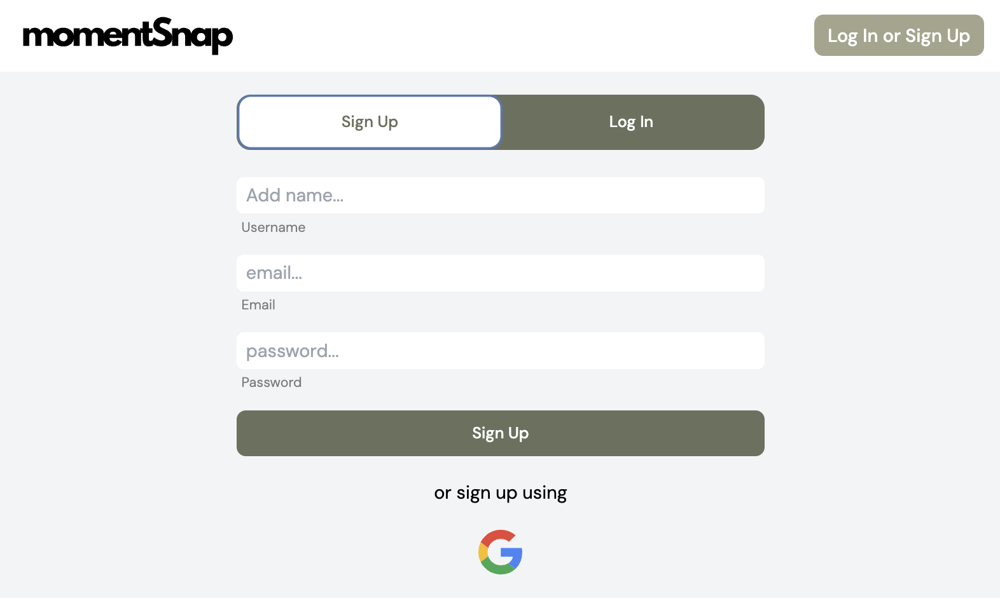
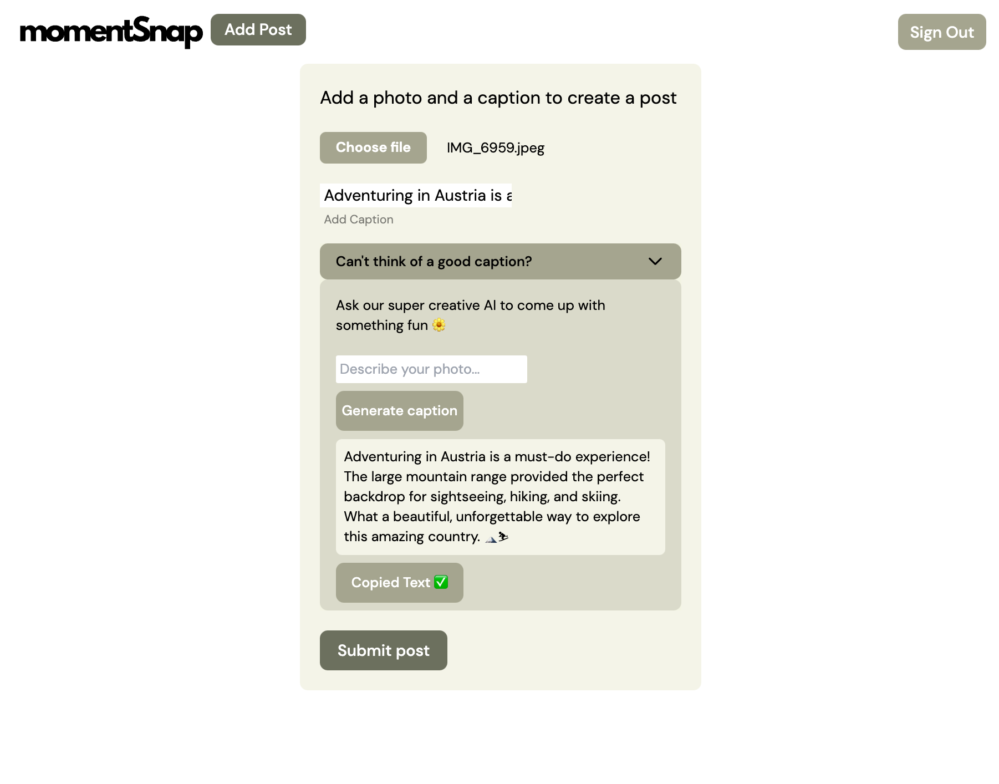

<h1>momentSnap - Interactive Social Media</h1>

<h2>Short Description</h2>
MomentSnap is a social media site for those who want to share their special moments with friends and interact with them by liking and commenting on each others' posts.

<h2>Demo</h2>
Checkout the <a href='https://xeniakadar.github.io/soc-clone/' target="_blank">live demo</a>.

<h2>Showcase</h2>

The images and the GIF are a great illustration to how the page works -

<h2>Performance</h2>

I used Google Lighthouse to run over my application to check its performance, accessibility, use of best practives and SEO opitimization.

<h2>Tech Stack</h2>
<ul>
<li>React</li>
<li>React Router Dom</li>
<li>Tailwind CSS</li>
<li>Headless UI</li>
<li>Firebase</li>
<li>OpenAI API</li>
<li>CSS</li>
<li>Git</li>
</ul>

<h2>What I learned</h2>
<ul>
<li>I dived into the world of Google Firebase, exploring its authentication, storage, and Cloud Firestore features. I gained hands-on experience and developed a solid grasp of these technologies. </li>
<li> Working with the OpenAI API to add a caption generator. I also explored fine-tuning to shape the AI model according to my needs.</li>
<li> Using Tailwind CSS and Headless UI to create a better and more responsive interface.</li>

</ul>
